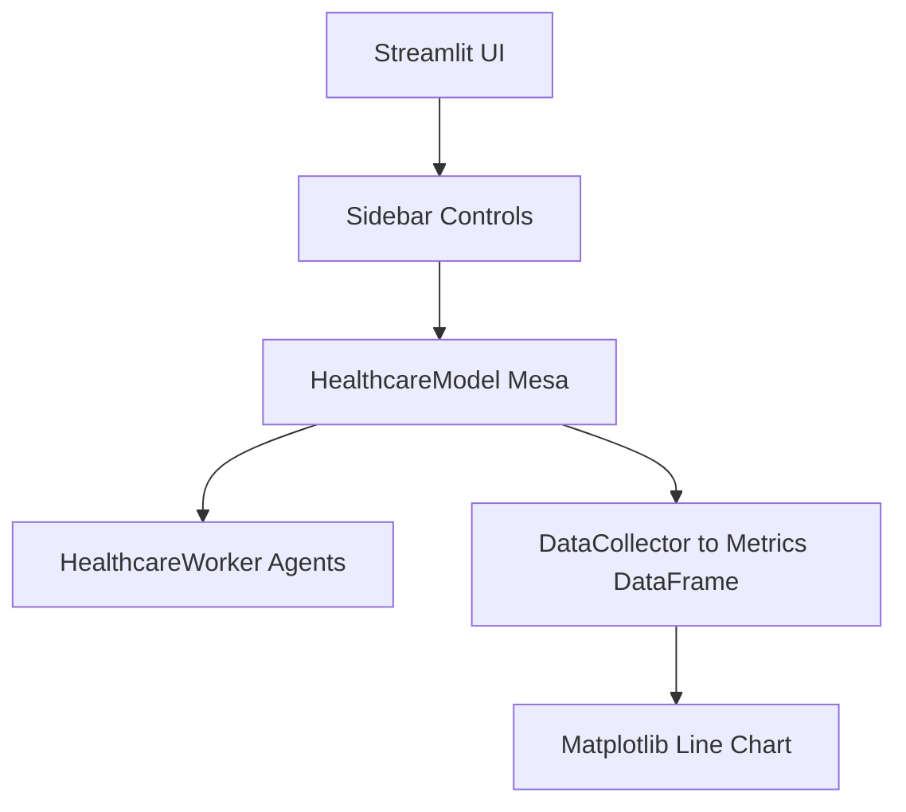

# Architecture (Reference)

- **Framework:** Streamlit front-end; Mesa agents + model; RandomActivation schedule; DataCollector for metrics.
- **Controls:** sidebar slider for agents (1–500; default 150), metric multiselect, start/stop.
- **Run loop:** up to 500 steps with incremental plotting and a short sleep to animate.

